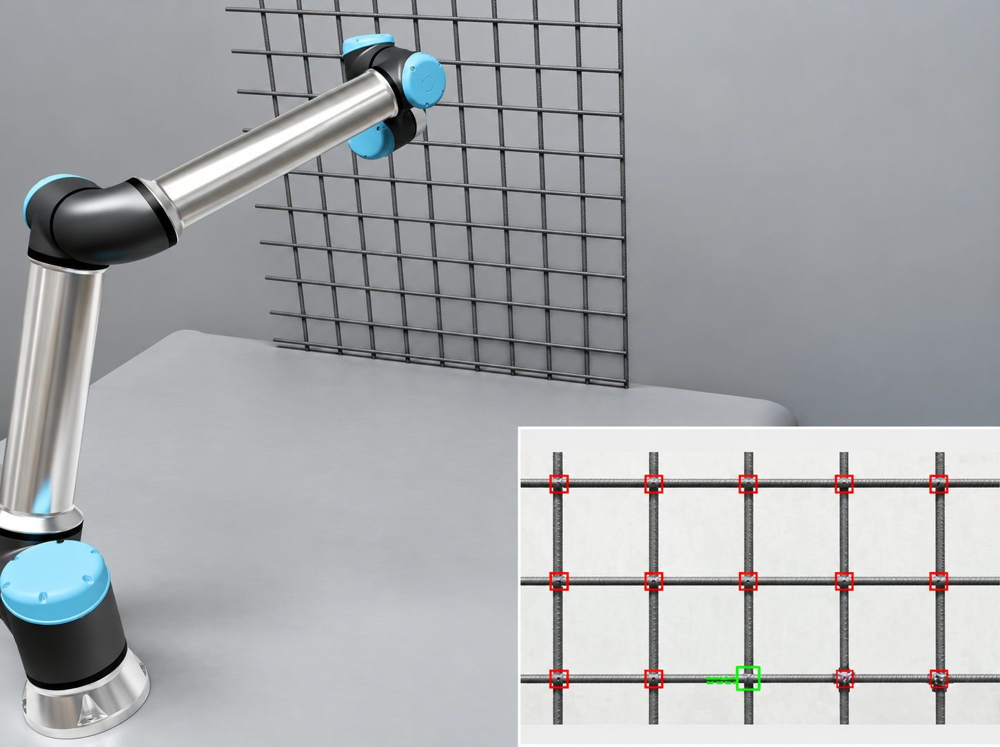

<p align="center">
  
</p>

# Isaac Sim UR10e Path Planning

ROS 2 and MoveIt 2 integration for an UR10e arm simulated in NVIDIA Isaac
Sim. The project demonstrates a camera-in-hand perception and motion pipeline
for visiting detected points on a vertical grid. The same pipeline can be
adapted to other repetitive point-to-point tasks such as painting, inspection,
or fastening.

## Demo

The recorded Isaac Sim demonstration is included here:

[Watch the demo video](media/VRT%20IsaacSim.mp4)

The demo shows the robot:

1. Moving to a scan pose.
2. Detecting grid intersections from the camera image with OpenCV line
   detection.
3. Back-projecting image points onto the rebar plane using camera intrinsics
   and the TF transform from the camera to `base_link`.
4. Planning collision-aware Cartesian motions through MoveIt.
5. Visiting the detected points in an alternating (snake-like) row order.

## Repository layout

```text
.
├── ur10e_isaacsim_moveit.py       # Isaac Sim standalone ROS 2 bridge
├── media/
│   └── VRT IsaacSim.mp4           # Recorded demonstration
├── src/
│   ├── moveit_ur10/               # UR10e MoveIt package and task pipeline
│   │   ├── config/                # URDF/Xacro, SRDF, controllers and RViz
│   │   ├── launch/                # ROS 2 launch files
│   │   └── scripts/
│   │       ├── rebar_detector.py  # Camera perception and 3D projection
│   │       └── rebar_supervisor.py# Visit ordering and MoveIt execution
│   ├── ur10e_description/         # Robot description and meshes
│   ├── VRT_USD/                   # Isaac Sim USD assets and action graph
│   ├── moveit2/                   # MoveIt 2 source checkout
│   └── trac_ik/                   # TRAC-IK source checkout
└── tf/                            # Saved TF tree exports
```

The `build/`, `install/`, and `log/` directories are generated ROS 2
artifacts and are intentionally excluded from version control.

## Requirements

- Ubuntu 22.04 (recommended)
- ROS 2 Humble
- MoveIt 2
- NVIDIA Isaac Sim with the ROS 2 bridge enabled
- A ROS 2 camera driver publishing:
  - `/rgb` (`sensor_msgs/msg/Image`)
  - `/camera_info` (`sensor_msgs/msg/CameraInfo`)
  - TF from `ZED_X` to `base_link`
- Python dependencies available in the ROS environment:
  - OpenCV
  - NumPy
  - SciPy
  - `cv_bridge`

The workspace includes local MoveIt 2, TRAC-IK, UR10e description, and
application packages under `src/`. Isaac Sim itself must be installed
separately.

## Build

Source ROS 2 and build the workspace:

```bash
source /opt/ros/humble/setup.bash
cd /path/to/Isaac-Sim-UR10e-Path-Planning
colcon build --symlink-install
source install/setup.bash
```

## Run the simulation

Start Isaac Sim with the standalone bridge script from an Isaac Sim Python
environment:

```bash
./python.sh /path/to/Isaac-Sim-UR10e-Path-Planning/ur10e_isaacsim_moveit.py
```

The script imports the UR10e URDF, creates the ROS 2 action graph, publishes
`/clock` and `/joint_states`, and subscribes to `/joint_command`. Update the
workspace paths near the top of the script if the repository is not located at
`/home/robotics/robo_ws`.

In a second terminal:

```bash
source /opt/ros/humble/setup.bash
source /path/to/Isaac-Sim-UR10e-Path-Planning/install/setup.bash
ros2 launch moveit_ur10 move_group.launch.py
```

To launch the perception and automatic visit sequence:

```bash
ros2 launch moveit_ur10 ur10e_rebar1.launch.py
```

The task launch starts MoveIt, `ros2_control`, the UR10e state publisher,
controllers, RViz, `rebar_detector.py`, and `rebar_supervisor.py`.

## How the pipeline works

### Perception

`rebar_detector.py` receives the RGB image and camera intrinsics. It uses
grayscale conversion, blur, Canny edges, and probabilistic Hough lines to
separate horizontal and vertical lines. Their intersections are clustered into
candidate image points.

At the scan pose, each point is projected into 3D by transforming a camera ray
into `base_link` and intersecting it with the configured plane
(`rebar_plane_y`). The resulting `PoseArray` is published on
`/rebar_intersections`.

### Planning and execution

`rebar_supervisor.py` moves the arm to its scan pose, triggers detection, and
waits for the intersection list. It requests collision-aware Cartesian paths
from MoveIt using `/compute_cartesian_path`, then sends the resulting
trajectory to `/arm_controller/follow_joint_trajectory`.

Detected poses are grouped into rows by their `z` coordinate and sorted by
`x`. The direction alternates for each row, producing a snake-like traversal.
The current implementation uses all detected intersections and infers the
rows from geometry. The `grid_rows` and `grid_cols` parameters in
`ur10e_rebar1.launch.py` are not currently used to filter or generate points.

## Useful topics

| Topic | Type | Purpose |
| --- | --- | --- |
| `/rgb` | `sensor_msgs/msg/Image` | Camera RGB input |
| `/camera_info` | `sensor_msgs/msg/CameraInfo` | Camera intrinsics |
| `/rebar_intersections` | `geometry_msgs/msg/PoseArray` | Detected 3D targets |
| `/detect_intersections` | `std_msgs/msg/Bool` | Trigger a scan |
| `/active_rebar_index` | `std_msgs/msg/Int32` | Highlight the active target |
| `/joint_states` | `sensor_msgs/msg/JointState` | Robot feedback |
| `/joint_command` | `sensor_msgs/msg/JointState` | Isaac Sim command input |

## Safety and limitations

This is a simulation and research prototype. Validate camera calibration,
frames, workspace limits, collision geometry, controller configuration, and
trajectory behavior before connecting any physical robot. The detector assumes
approximately horizontal and vertical image lines and a known planar target.

## License

The application package retains the BSD license metadata from its generated
MoveIt configuration. Review and add a repository-level license before
redistributing the complete workspace, including third-party MoveIt 2 and
TRAC-IK source trees.
